# Building

Most of this demo is captured in Cloudformaton.  For those services that are not we will have to use the cli or the AWS console.

Due to dependencies within this system we will need to build the interconnected services in a particular order.

**Insure you have the correct region set!**

## Step 1

### Build out Amazon Connect instance

First you will want to access the [Amazon Connect Console](https://console.aws.amazon.com/connect).

If you have already created an instance you can "Add an Instance", if you have not you will see the following screen, where you can click "Get Started".

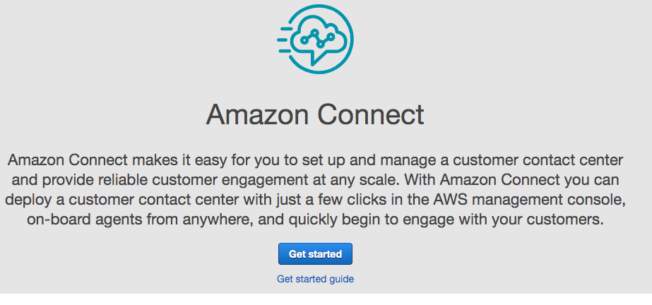


On the next page you will need to enter in a unique name for your instance.

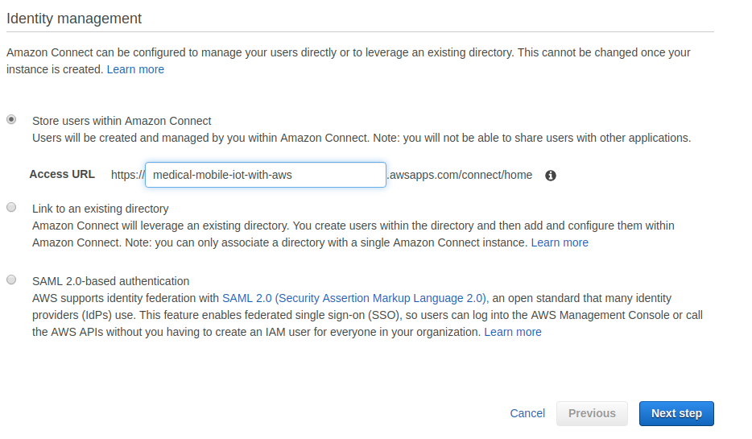


We can skip creating a new admin for this demo

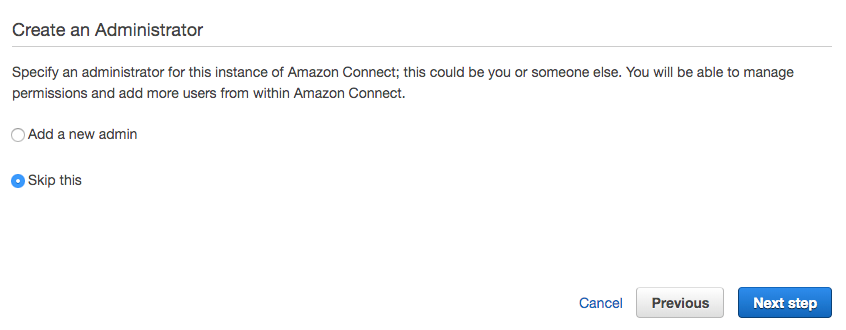


We will only be making outbound calls

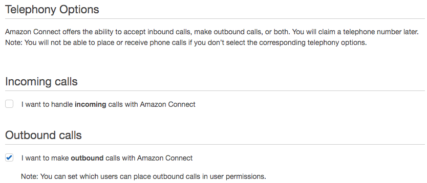

We can click next on the data storage page

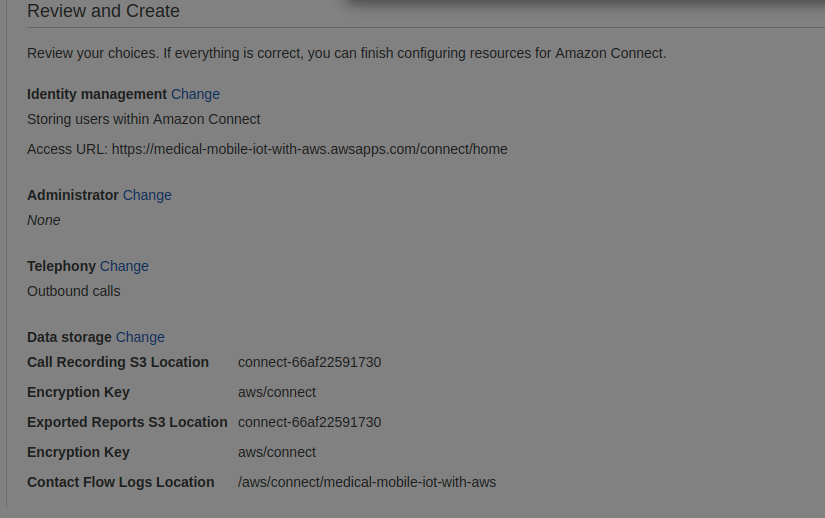


Finally we can create our instance.

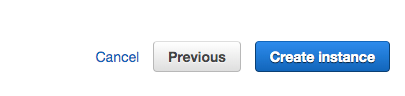

Click "Get Started" to access the Amazon connect console.

## Step 2

### Claim a number

Under the menu on the Amazon Connect Console click Routing -> Phone numbers

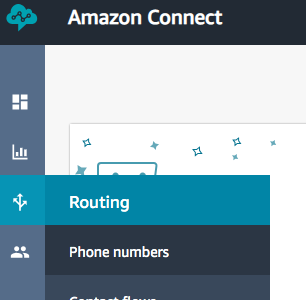

Then click claim a number

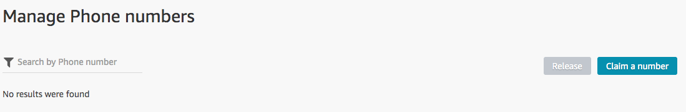

Choose you country code and pick a number from the available options and click save, no other fieslds are needed.

**Save this number!**

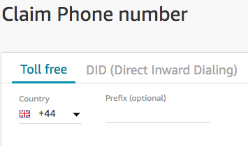

## Step 3

### Build the contact a doctor contact flow

Under the menu on the Amazon Connect Console click Routing -> Contact Flows

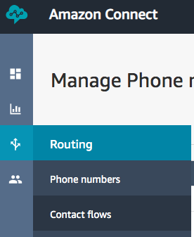

Press "Create a contact flow"

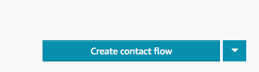

This will provide an area where you can build the contact flow.  We will be importing one provided in this repository.

Click the "Import flow(beta)" in the dropdown menu next to "Save".

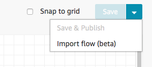

Choose the file in this repository

```bash
contactflows/calldoctor.json
```

This should import a flow chart that looks similair to this:

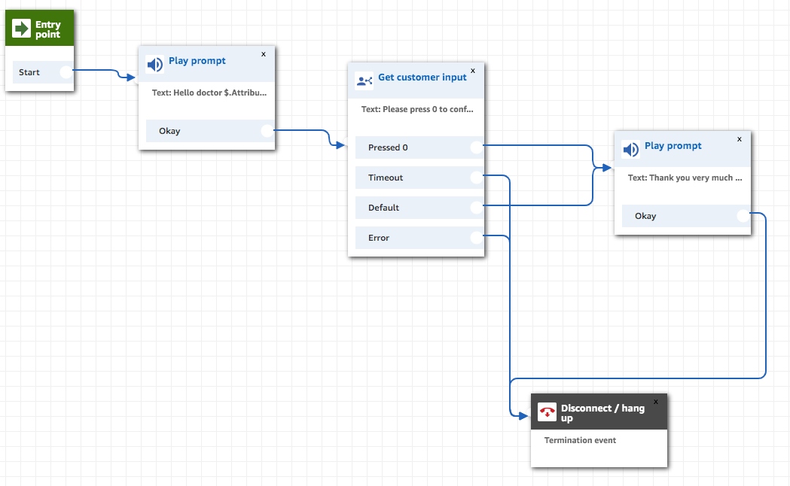

**Be sure to "Save & Publish" not just save**

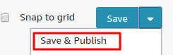

Click on "Show addition flow information"

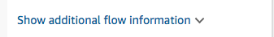

A drop down will appear with fields, we are only interested in the ARN field.  Copy that, it will be needed in the future.

We will need the components that make up the ARN not the entire arn itself. The fields we will need are:
- Amazon Connect Instance ID
- Contact flow ID

```bash
arn:aws:connect:us-east-1:123456789012:instance/{this is your instance id}/contact-flow/{this is your flow id}
```

**Copy and save these fields.**

## Step 4

### Deploy the lambda that will trigger the doctor contact flow

To deploy the lambda open the **calldoctor.json** file and enter the fields we saved earlier.

```json
[

  {
    "ParameterKey": "ConnectInstance",
    "ParameterValue": ""
  },
  {
    "ParameterKey": "ContactFlowId",
    "ParameterValue": ""
  },
  {
    "ParameterKey": "SourcePhoneNumber",
    "ParameterValue": ""
  }
]

```

Now we can deploy the lambda with the AWS CLI using cloudformation. (Update region if necessary)

```bash
aws cloudformation create-stack --template-body file://calldoctor.yaml \
	--capabilities CAPABILITY_IAM --stack-name medical-mobile-iot-with-aws-doctor \
	--region us-east-1 --parameters file://calldoctor.json
```

When the stack is done deploying it provides an arn for the lambda it creates. We need to retrieve that arn

```bash
aws cloudformation describe-stack --stack-name medical-mobile-iot-with-aws-doctor \
 --region us-east-1 \
 --query 'Stacks[0].Outputs[?OutputKey==`CallDoctorLambdaArn`].OutputValue' \
 --output text
```

**Save this ARN**

## Step 5

### Create the Lex Bot

You can deploy Lex Bot by running.
```bash
cd lex
./deploy.sh
```
If you are running in a different region than us-east-1 edit the file to reflect the region you are using, before running the script.

## Step 6

### Create the patient contact flow

Open the file
```bash
contactflows/callpatient.json
```
and replace "ADD CALL DOCTOR ARN HERE" with the arn we just saved from the Lambda.

Return to the Amazon Connect Console

Under the menu on the Amazon Connect Console click Routing -> Contact Flows


Press "Create a contact flow"


This will provide an area where you can build the contact flow.  We will be importing one provided in this repository.

Click the "Import flow(beta)" in the dropdown menu next to "Save".


Choose the file
```bash
contactflows/callpatient.json
```
**Be sure to "Save & Publish" not just save**


Click on "Show addition flow information"


The instance ID should be the same so we will just need the Contact flow ID

```bash
arn:aws:connect:us-east-1:123456789012:instance/{this is your instance id}/contact-flow/{this is your flow id}
```

**Copy and save these fields.**

## Step 7
 
### Deploy the remaining stack
  
To deploy the remaining stack open the **stack.json** file and enter the fields we saved earlier.  We are using the call patient flow from Step 6!


Now we can deploy the stack (Update region if necessary)

```bash
aws cloudformation create-stack --template-body file://stack.yaml \
	--capabilities CAPABILITY_IAM --stack-name medical-mobile-iot-with-aws-stack \
	--region us-east-1 --parameters file://stack.json
```

When the stack is finished deploying we will need to retrieve some final parameters to integrate our mobile application.

```bash
aws cloudformation describe-stacks --stack-name ga-test2 --region us-east-1 --query 'Stacks[0].Outputs'
```

## Step 8

### Building Quicksight
[Sign up for Quicksight](https://docs.aws.amazon.com/quicksight/latest/user/setup-new-quicksight-account.html)

Go to quicksight in your console.

## Step 9

### Running the mobile App

Source for the mobile application can be found in the react-app folder

There are several options for running the mobile application.

1. If you have expo installed you can run it with the [expo cli](https://docs.expo.io/versions/latest/workflow/up-and-running/)
2. You can build from source yourself with [expo](https://docs.expo.io/versions/latest/distribution/building-standalone-apps/)
3. You can utilize the prebuilt apk under [releases](https://github.com/awslabs/medical-mobile-iot-with-aws/releases) and [load the application with adb]().

### Configuring the mobile app

Once the app is running you will need to add the server settings that cloudformation had provided on the last stack deployment.

Click the server settings button.

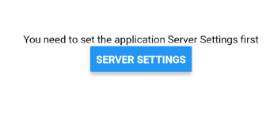

Enter in the values from the stack.


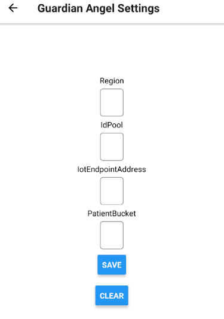

If the information was entered in correctly you will be sending data to your newly built system.

We now need to add the contact information for the "Patient" and "The Doctor"

Click on "User Settings" and fill the fields with names and valid phone numbers.

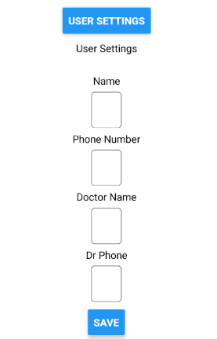

And click save.

This information will be saved to S3.

# Triggering a patient call

Leave the application running for a few minutes.

This establishes the baseline of "normal" and the anamoly detection will trigger when values vary from this baseline.

Then you can trigger a call to your phone by moving the slider.


