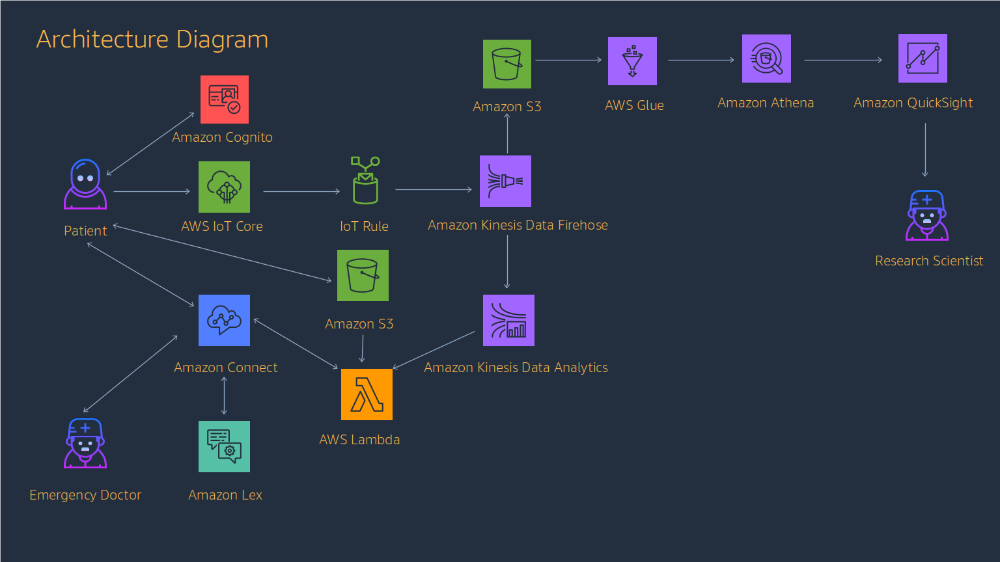

## Medical Mobile Iot With AWS

A demo designed to demonstrate how to bring together disparate AWS services to rapidly develop highly scalable applications.

The demo is based on an application that you run on your phone that pairs with a wearable device and sends some physical telemetry data.

Since there is no device, we will simulate changing telemetry data with an app on the phone that can adjust the data level with a slider.

This app then sends the data to AWS.

If telemetry data goes through rapid fluctuation, the patient will be called and asked about their health.  If the patient does not answer that they are "OK" or does not respond, a Doctor will be called and told of health problems with the patient.

 
# Components

## Required tools

- AWS Account
- 2 phone numbers (please read Amazon Connect restrictions below)
- [AWS CLI](https://aws.amazon.com/cli/)
- An android or iOS phone or an emulator/simulator

## Services
The demo is constructed using the following services:

- [Amazon Connect](https://aws.amazon.com/connect/)
- [AWS Lex](https://aws.amazon.com/connect/)
- [AWS IoTCore](https://aws.amazon.com/iot/)
- [Amazon Cognito](https://aws.amazon.com/cognito/)
- [Amazon Kinesis Data Firehose](https://aws.amazon.com/kinesis/data-firehose/)
- [Amazon Kinesis Data Analytics](https://aws.amazon.com/kinesis/data-analytics/)
- [AWS Lambda](https://aws.amazon.com/lambda/)
- [Amazon S3](https://aws.amazon.com/s3/)
- [AWS Glue](https://aws.amazon.com/glue/)
- [Amazon Athena](https://aws.amazon.com/athena/)
- [Amazon Quicksight](https://aws.amazon.com/quicksight/)

## SDKs

And the following SDKs

- [Boto3](https://boto3.amazonaws.com/v1/documentation/api/latest/index.html?id=docs_gateway)
- [AWS Amplify](https://aws-amplify.github.io/)
- [AWS SDK (NodeJS)](https://aws.amazon.com/sdk-for-node-js/)
- [Expo](https://expo.io/)
- [ReactNative](https://facebook.github.io/react-native/)

# Restrictions

## Amazon Connect

This demo requires the system to call a phone number.  Amazon Connect is [limited on countries it which it can place calls](https://docs.aws.amazon.com/general/latest/gr/aws_service_limits.html#limits_amazon_connect).

You can place calls to the following dialing codes when you create a new instance:
- Australia
- Canada
- China
- Germany
- Hong Kong
- Israel
- Japan
- Mexico
- Singapore
- Sweden
- United States
- United Kingdom (UK numbers with a 447 require a service limit increase request).

## Regions

For the full demo to work you are restricted to the following regions

- US East (N. Virginia)
- US West (Oregon)

## Building
Jump to [BUILDING.md](./BUILDING.md) to start building the demo.

## License Summary

The documentation is made available under the Creative Commons Attribution-ShareAlike 4.0 International License. See the LICENSE file.

The sample code within this documentation is made available under the MIT-0 license. See the LICENSE-SAMPLECODE file.

